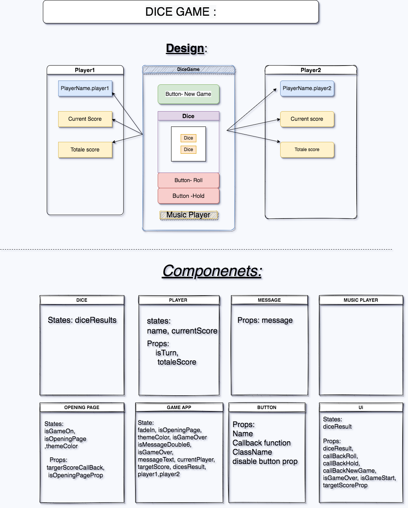

# Dice Game 
## React, Js, CSS

https://dice-game-dk.netlify.app/

###A game using react

###Features:
- Using React states and props to manage score and functions
- Customizable background and target score
- Sound and Music

##Components :
- Opening page - managing Button components and functions to set the game background and target score
- Main page game - managing all the game logic and other the other components
- Button  - customizable button
- Dice - showing the dice images
- Message - showing a message to the player
- Music player- an Audio player for music
- Player - showing score and the current player
- Ui - a component that pass props and function to the Button and Dice components 

##States:
- fadeIn: 'fade-in'
- isOpeningPage: true
- themeColor: 'classic'
- isGameStart: false
- isMessageDouble6: false
- isGameOver: false
- messageText: null
- currentTurnPlayer: 'player1'
- targetScore: 0
- dicesResult: [0, 0],
- currentTurnResult: null
- player1: {
  name: 'Player1',
  currentScore: 0,
  totalScore: 0,
  isTurn: true
  },
- player2: {
  name: 'Player2',
  currentScore: 0,
  totalScore: 0,
  isTurn: false
  }

